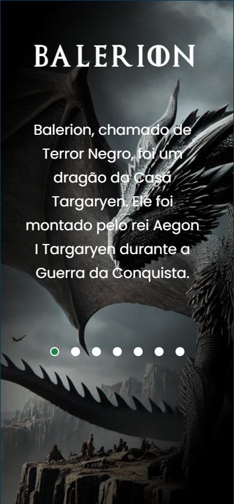

# Projeto - Casa do Dragão

Site desenvolvido no curso DevQuest sobre a série de TV "Casa do Dragão" utilizando HTML5, CSS e JavaScript. Tem um carrossel de imagens e informações sobre os dragões da série. Foi o primeiro projeto que subi para o Github.

## Sumário

- [Visão Geral](#visão-geral)
  - [Screenshot](#screenshot)
  - [Links](#links)
- [Meu Processo](#meu-processo)
  - [Tecnologias](#tecnologias)
  - [Continuar Desenvolvendo](#continuar-desenvolvendo)
- [Autor](#autor)

## Visão Geral

### Screenshot

### Links

- Live Site URL: [Clique aqui](https://gbloureiros.github.io/site-casa-do-dragao/)

## Meu processo

### Tecnologias

- HTML5
- CSS
- JavaScript

### Continuar Desenvolvendo

No futuro tenho vontade de criar outros projetos parecidos mas com outros temas, ou até mesmo trocar o tema desse projeto por um outro.

## Autor

- Website - [Gabriel Loureiro](https://gbloureiros.github.io/portfolio/)
- LinkedIn - [@gabrielloureiros](https://www.linkedin.com/in/gabrielloureiros/)
- Instagram - [@gabriel.loureiros](https://www.instagram.com/gabriel.loureiros/)
